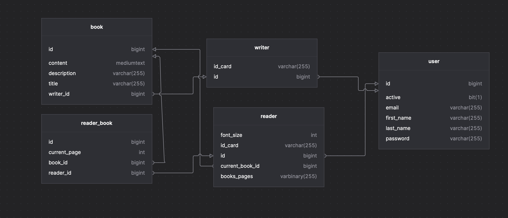

# Personal Library API Documentation

## Overview

The Personal Library API is a robust backend system designed to manage and interact with a personal book library. This document provides a technical overview of the project, highlighting the technologies used, best practices followed, and the structure of the project.

### Personal Library API Documentation

<p align="center">
  
  
</p>

<p>
  
</p>

## Table of Contents

- [Technologies & Libraries](#technologies--libraries)
  - [Spring Boot](#spring-boot)
  - [OAuth2 with JWT](#oauth2-with-jwt)
  - [Lombok](#lombok)
  - [Database & JPA](#database--jpa)
  - [Spring Security](#spring-security)
  - [Spring Actuator](#spring-actuator)
- [API Endpoints](#api-endpoints)
  - [User Authentication](#user-authentication)
  - [Book Management](#book-management)
  - [Book Details](#book-details)
  - [Reading Flow and Pagination](#reading-flow-and-pagination)
- [Frontend](#frontend)
  - [Features](#features)
- [Testing](#testing)
  - [Cypress](#cypress)
  - [Postman](#postman)
- [Conclusion](#conclusion)

## Technologies & Libraries

### Spring Boot

The core of the project is built using **Spring Boot**, a widely-used framework for creating stand-alone, production-grade Spring-based applications. Spring Boot simplifies the process of building production-ready applications by providing defaults for code and annotation configurations.

### OAuth2 with JWT

For user authentication, the project utilizes **OAuth2** with **JSON Web Tokens (JWT)**. This ensures a secure and standardized method for token-based authentication on the platform.

### Lombok

**Lombok** is integrated into the project to reduce boilerplate code. With Lombok, the project can automatically generate getters, setters, constructors, and other common methods, leading to cleaner and more readable code.

### Database & JPA

The project uses **Spring Data JPA** for seamless integration with databases. This allows for easier data access and manipulation using Java Persistence API.

### Spring Security

**Spring Security** is employed to protect the REST endpoints and ensure data confidentiality. With Spring Security, the project can define role-based access controls, ensuring that only authorized users can access specific functionalities.

### Spring Actuator

**Spring Boot Actuator** is added to the project to provide production-ready features like health checks and metrics, which can be used to monitor and manage the application.

## API Endpoints

### User Authentication

#### 1. Register
- **URL**: `http://localhost:8080/api/auth/register`
- **Method**: POST
- **Body**: Contains user details like `firstName`, `lastName`, `email`, `password`, and `isWriter`.

#### 2. Login
- **URL**: `http://localhost:8080/api/auth/login`
- **Method**: POST
- **Body**: Contains user `email` and `password`.

#### 3. Me
- **URL**: `http://localhost:8080/api/auth/me`
- **Method**: GET
- **Headers**:
    - Authorization: Bearer [token_value]

#### 4. Refresh Token
- **URL**: `http://localhost:8080/api/auth/token`
- **Method**: POST
- **Body**: Contains `refreshToken`.

### Book Management

#### 5. Create Book
- **URL**: `http://localhost:8080/api/books`
- **Method**: POST
- **Headers**:
    - Authorization: Bearer [token_value]
- **Body**: Contains book details like `title`, `description`, and `content`.

#### 6. GET Books
- **URL**: `http://localhost:8080/api/books`
- **Method**: GET

#### 7. GET Books Search
- **URL**: `http://localhost:8080/api/books/search?title=${title}&keyword=${description}&writerName=${content}`
- **Method**: GET

#### 8. GET Book
- **URL**: `http://localhost:8080/api/books/${bookId}`
- **Method**: GET

#### 9. Authenticated User's Books
- **Description**: Retrieves a list of books associated with the authenticated user.
- **URL**: `http://localhost:8080/api/books/my`
- **Method**: GET
- **Headers**:
  - Authorization: Bearer [token_value]

#### 10. Add Book
- **Description**: Adds a book to the system.
- **URL**: `http://localhost:8080/api/books/${bookId}/add`
- **Method**: PATCH
- **Headers**:
    - Authorization: Bearer [token_value]

#### 11. Remove Book
- **Description**: Removes a book from the system.
- **URL**: `http://localhost:8080/api/books/${bookId}/remove`
- **Method**: DELETE
- **Headers**:
    - Authorization: Bearer [token_value]

### Book Details

#### 12. GET Book Writer
- **Description**: Retrieves the writer of the specified book.
- **URL**: `http://localhost:8080/api/books/${bookId}/writer`
- **Method**: GET

#### 13. GET Book Current Readers
- **Description**: Retrieves a list of current readers for a given book.
- **URL**: `http://localhost:8080/api/books/${bookId}/currentreaders`
- **Method**: GET
- **Headers**:
    - Authorization: Bearer [token_value]

#### 14. GET Book Readers
- **Description**: Retrieves a list of all readers of a specified book.
- **URL**: `http://localhost:8080/api/books/${bookId}/readers`
- **Method**: GET
- **Headers**:
    - Authorization: Bearer [token_value]

### Reading Flow and Pagination

#### 15. Read Book
- **Description**: Marks a book as read for the authenticated user.
- **URL**: `http://localhost:8080/api/books/${bookId}/read`
- **Method**: PATCH
- **Headers**:
    - Authorization: Bearer [token_value]

#### 16. Next Book Page
- **Description**: Navigates to the next page of book listings.
- **URL**: `http://localhost:8080/api/books/nextpage`
- **Method**: PATCH
- **Headers**:
    - Authorization: Bearer [token_value]

#### 17. Prev Book Page
- **Description**: Navigates to the previous page of book listings.
- **URL**: `http://localhost:8080/api/books/prevpage`
- **Method**: PATCH
- **Headers**:
    - Authorization: Bearer [token_value]

## Frontend

The frontend for the Personal Library API has been developed using React. It provides a user-friendly interface to interact with all the features and functionalities offered by the backend API.

**Frontend Repository:** [Personal Library Frontend](link_to_frontend_repository)

### Features:
- **User Authentication:** Secure login and registration system.
- **Book Management:** Add, update, and remove books from your collection.
- **Search Functionality:** Search for books based on title, author, or genre.
- **Book Details:** View detailed information about each book, including its writer and readers.
- **Responsive Design:** Looks great on both desktop and mobile devices.

## Testing

### Cypress

End-to-end tests have been written using Cypress to ensure the frontend interacts correctly with the backend API. These tests cover various user scenarios and edge cases.

To run the tests, navigate to the root directory of the frontend project and execute:

```bash
npx cypress open
```

All test files are located in the `/tests` folder.

### Postman

For API testing and documentation, a Postman collection has been provided. This collection contains all the API endpoints with example requests.

**Collection File:** `PersonalLibrary.postman_collection.json`

To use the Postman collection:

1. Open Postman.
2. Click on "Import" and select the `PersonalLibrary.postman_collection.json` file from the root directory.
3. Once imported, you can send requests to the API endpoints directly from Postman.

## Conclusion
Interact with the API endpoints as described to manage and retrieve data from the Personal Library system. Always ensure to use the correct headers and body parameters as necessary.